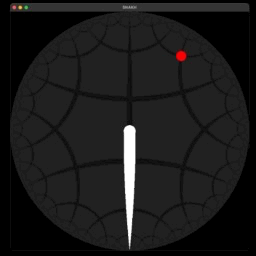

# SNAKH

Controls:
- WASD / arrows: move around
- Equals `=`: increase speed
- Hyphen `-`: decrease speed
- R: restart
- Esc: exit

Your casual snake game - except everything takes place in a:

## Hyperbolic plane

That's one of the famous non-euclidean planes for your snake to explore. The grid layout is somewhat like the hyperbolic counterpart of Platonic solids, with every vertex connecting four others and every "face" consisting of five sides. Lines won't stay parallel. Two lines, however close they are at some point, quickly drifts away as they extend. Our snake had better try not to get lost as it searches for those apples.

It's is a headache to deal with such grids - not just out of how confusing it is. This project requires a whole lot of:

## Computational geometry

My intuition is not sharp enough to notice any special properties that immediately tell me what the structure of this graph is like. So I adopted this simpleminded method: to know whether two points overlap, I simply check if the coordinates of two points are strictly equal.

*Wait, what about floating point errors??*

In fact, I've always been paranoid about floating points and would avoid them wherever possible. My calculations have shown that all numbers in those coordinates can be represented by $\frac{a + b \sqrt{5}}{c}$ where $a, b, c$ are integers. By implementing a structure that handles just that, I got to throw away all those floating point numbers.

But that leaves us with a problem...

## Encouraging the player to stay near the origin

*\*lets out a deeeep sigh\**

Okay. Hyperbolic planes are boundless. I know how I could have made an open-world thing. But *I'm dangerously close to the deadline*. I can think of a few solutions, but then I'll lose my race against the clock. That's a serious technical debt to be tackled, were I to further maintain this.

Here's the issue: far-away coordinates *grow exponentially*. The origin is just tens of steps away from the `long long` maximum. Beyond that, lies the absurd domain of unknown. Of chaos. Of eldritch, unspeakable horror.

Right now, apples only generate near the origin. In the meantime, all I can do is to trust my players in that, for their own sake, they know better than wandering too far away.
